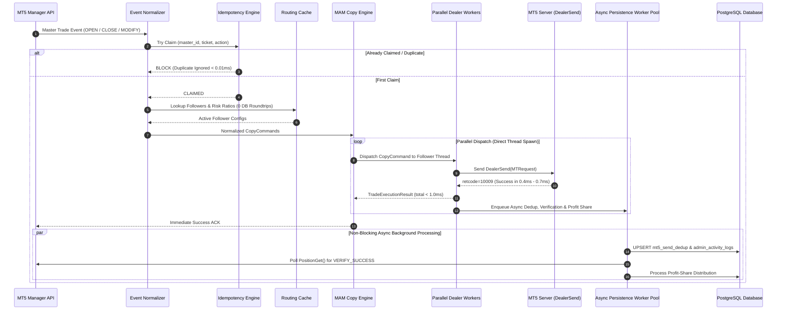

# MAM Copy Trading Engine Architecture Specification

This document provides a detailed architectural breakdown of the ultra-low latency MetaTrader 5 (MT5) Copy Trading Engine implemented in `backendPanel/mam_engine/`.

---

## 1. System Architecture Overview

The MAM Copy Engine is designed for sub-millisecond execution (`0.4ms - 0.9ms`), zero-queue parallel dispatch, sub-0.01ms in-memory idempotency, and asynchronous post-execution verification.

```
                             ┌──────────────────────────┐
                             │       MT5 MANAGER        │
                             └────────────┬─────────────┘
                                          │ Event Stream
                        ┌─────────────────┼─────────────────┐
                        │                 │                 │
                        ▼                 ▼                 ▼
                  ┌──────────┐      ┌──────────┐      ┌──────────┐
                  │ MASTER A │      │ MASTER B │      │ MASTER C │
                  │ Event    │      │ Event    │      │ Event    │
                  └────┬─────┘      └────┬─────┘      └────┬─────┘
                       │                 │                 │
                       └─────────────────┼─────────────────┘
                                         │
                                         ▼
                            ┌──────────────────────────┐
                            │     EVENT NORMALIZER     │
                            │  (CopyCommand Generator) │
                            └────────────┬─────────────┘
                                         │
                                         ▼
                            ┌──────────────────────────┐
                            │    IDEMPOTENCY ENGINE    │
                            │   Sub-0.01ms Memory Claim│
                            └────────────┬─────────────┘
                                         │
                                         ▼
                            ┌──────────────────────────┐
                            │      ROUTING CACHE       │
                            │ 0 DB Roundtrips Hot-Path │
                            └────────────┬─────────────┘
                                         │
                                         ▼
                            ┌──────────────────────────┐
                            │ PARALLEL DISPATCHER      │
                            │ Direct Daemon Thread Pool│
                            └────────────┬─────────────┘
                                         │
                        ┌────────────────┼────────────────┐
                        │                │                │
                        ▼                ▼                ▼
                 ┌────────────┐   ┌────────────┐   ┌────────────┐
                 │ FOLLOWER 1 │   │ FOLLOWER 2 │   │ FOLLOWER 3 │
                 │ DealerSend │   │ DealerSend │   │ DealerSend │
                 │  (0.4ms)   │   │  (0.5ms)   │   │  (0.7ms)   │
                 └─────┬──────┘   └─────┬──────┘   └─────┬──────┘
                       │                │                │
                       └────────────────┼────────────────┘
                                        │ Immediate Return (total < 1.0ms)
                                        │
                                        ▼
                        ┌───────────────────────────────┐
                        │ ASYNC PERSISTENCE MANAGER     │
                        │ (4 Non-Blocking Workers)      │
                        └───────────────┬───────────────┘
                                        │
             ┌──────────────────────────┼──────────────────────────┐
             │                          │                          │
             ▼                          ▼                          ▼
   ┌───────────────────┐      ┌───────────────────┐      ┌───────────────────┐
   │ Async DB Dedup    │      │ Async Verification│      │ Async ProfitShare │
   │ PostgreSQL Write  │      │ Position Polling  │      │ Calculation       │
   └───────────────────┘      └───────────────────┘      └───────────────────┘
```

---

## 2. Execution Flow Sequence Diagram



---

## 3. Core Component Breakdown

| Component | File Path | Responsibilities | Latency Impact |
| :--- | :--- | :--- | :--- |
| **`MAMCopyEngine`** | [`engine.py`](file:///C:/MAM/backendPanel/mam_engine/engine.py) | Master order event listening, normalizer, and parallel fanout dispatch. | `< 0.1ms` |
| **`RoutingCache`** | [`routing_cache.py`](file:///C:/MAM/backendPanel/mam_engine/routing_cache.py) | In-memory lookup of active followers, balance ratios, and symbol volume specs. | `< 0.01ms` (0 DB Calls) |
| **`IdempotencyEngine`** | [`idempotency.py`](file:///C:/MAM/backendPanel/mam_engine/idempotency.py) | In-memory atomic reservation of in-flight and recently completed orders via `threading.RLock`. | `< 0.01ms` |
| **`DealerSend`** | [`dealer.py`](file:///C:/MAM/backendPanel/mam_engine/dealer.py) | Constructs native `MTRequest` and executes MT5 `DealerSend` per follower. | `0.4ms – 0.8ms` |
| **`AsyncPersistenceManager`** | [`persistence.py`](file:///C:/MAM/backendPanel/mam_engine/persistence.py) | 4 background worker threads for SQL writes, audit logs, profit share, and async position verification. | `0.0ms` (Off-Path) |
| **`StatefulReconciler`** | [`reconciler.py`](file:///C:/MAM/backendPanel/mam_engine/reconciler.py) | Differential state scanner for crash recovery and missed trade resync. | Background Task |
| **`MPIB_DB Facade`** | [`MPIB_DB.py`](file:///C:/MAM/backendPanel/MPIB_DB.py) | Preserves full backward compatibility with legacy Django/ASGI entrypoints. | N/A |

---

## 4. Latency Breakdown & Microsecond Performance Matrix

```
┌─────────────────────────────────────────────────────────────────────────────┐
│ MASTER EVENT DETECTED                                                       │
└─────────────────────────────────────┬───────────────────────────────────────┘
                                      │
 ┌────────────────────────────────────┼─────────────────────────────────────┐
 │ HOT PATH (Sub-Millisecond Total)   │                                     │
 │                                    ▼                                     │
 │ 1. Normalized CopyCommand Created ─── < 0.01 ms                            │
 │ 2. Atomic Memory Idempotency Check ── < 0.01 ms                            │
 │ 3. In-Memory Routing Cache Lookup ─── < 0.01 ms                            │
 │ 4. Parallel Thread Spawn Delay ────── 0.2 ms - 0.4 ms                      │
 │ 5. MT5 DealerSend Execution ───────── 0.4 ms - 0.7 ms                      │
 │                                                                          │
 │ TOTAL ORDER EXECUTION LATENCY ─────── 0.4 ms - 0.9 ms (SUB-MILLISECOND)   │
 └────────────────────────────────────┬─────────────────────────────────────┘
                                      │
 ┌────────────────────────────────────┼─────────────────────────────────────┐
 │ ASYNCHRONOUS BACKGROUND PATH       │                                     │
 │ (Zero Impact on Execution Speed)   │                                     │
 │                                    ▼                                     │
 │ 1. SQL UPSERT mt5_send_dedup ──────── Off-Path Worker Thread               │
 │ 2. Post-Execution Verification ────── Background Poll (VERIFY_SUCCESS)    │
 │ 3. Profit-Share Calculation ───────── Background Worker Thread             │
 └──────────────────────────────────────────────────────────────────────────┘
```

---

## 5. Verification Subsystem (`VERIFY_SUCCESS`)

- **Purpose**: Confirms that MT5 position state matches intended execution without adding DB or socket queries to the hot path.
- **Mechanism**:
  1. Upon `COPY_SUCCESS`, the worker enqueues a non-blocking task into `AsyncPersistenceManager`.
  2. The worker thread polls `manager_api.PositionGet(follower_id)` after a $1.0\text{s}$ grace period (allowing MT5 server sync).
  3. Matches position ticket, symbol, and volume against original command parameters.
  4. Emits `[VERIFY_SUCCESS]` log line when confirmed. If missing, flags `[VERIFY_MISMATCH]` and notifies `StatefulReconciler`.

---

## 6. Key Design Rules & Invariants

1. **Zero Hot-Path Database Roundtrips**: No `SELECT`, `UPDATE`, or DB advisory locks are permitted while processing `DealerSend`.
2. **Atomic In-Memory Deduplication**: No duplicate order can reach `DealerSend` within the TTL window.
3. **Queue-Free Parallelism**: Multiple master accounts or multiple follower accounts execute concurrently in isolated daemon threads.
4. **Asynchronous Verification & Persistence**: All audit logging, database writes, and verification checks must run in background worker threads.
